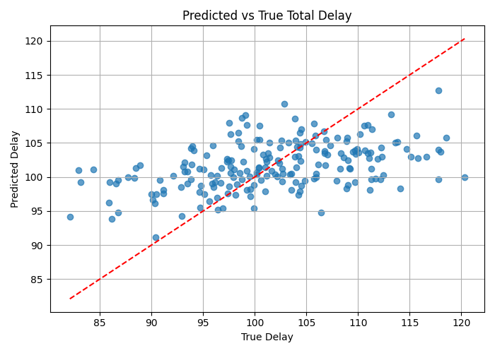

# 🧠 Chip-GNN-Opt: Predicting Netlist Wire Delay with Graph Neural Networks

This project simulates synthetic semiconductor netlists as graphs and uses Graph Neural Networks (GNNs) — specifically GATConv with BatchNorm and Dropout — to predict **total wire delay**. It’s designed to showcase how AI can help in optimizing chip design timing.

---

## 🔧 Features

- Generates synthetic netlist graphs using NetworkX
- GATConv-based model with Dropout and BatchNorm
- Global mean pooling for graph-level regression
- Trains on 200+ synthetic graphs
- Predicts total signal propagation delay
- Visualizes prediction vs ground truth

---

## 📁 Project Structure

chip-gnn-opt/
├── src/
│ ├── train.py # Training loop
│ ├── graph_dataset.py # Custom PyG dataset
│ ├── graph_to_pyg.py # Convert networkx to PyG format
│ └── netlist_graph_gen.py # Generates synthetic netlist graphs
├── models/
│ └── gnn_model.py # GATConv model definition
├── outputs/
│ └── pred_vs_true.png # Plot of predicted vs true delay
├── requirements.txt # Dependencies
└── README.md # This file


---

## 📈 Results

<p align="center">
  
</p>

- **Input**: Graph of chip components with edge delays
- **Output**: Predicted total netlist delay
- Most predictions closely align with ground truth

---

## 🚀 Getting Started

### 1. Clone the repo

```bash
git clone https://github.com/AayushA10/chip-gnn-opt.git
cd chip-gnn-opt
